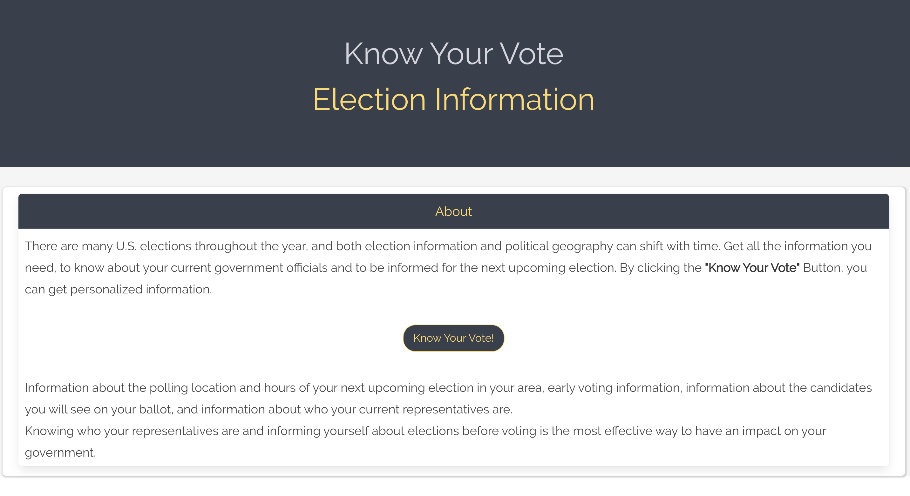

# Know Your Vote


## Table of Content

*[User Story](#User)

*[Description](#Description)

*[Installation](#Installation)

*[Usage](#Usage)

*[Future Improvements](#Future)

*[Technologies](#Technologies)

*[Deployed Link](#Deployed)

*[Contribution](#Contribution)

*[Questions](#Questions)

*[Team](#Team)

## User Story

```
As a registered voter I want to be able to quickly access information about polling locations, early voting hours, candidates on the ballot, and my current representatives so that I make an informed decision when I am ready to vote.
```

## Description

'Know Your Vote' is an application that allows a user to look up information about polling location, hours, early vote hours and locations, candidates on the ballot (and their affiliation) and his/her current representatives, specified by an entered address. This application makes use of the third party APIs Google Civic Information and Google Maps and was created as a team project using Bootstrap, Bulma, JavaScript, JQuery and AJAX requests. The Google Civic Information API provides information shortly before an election occurs, but might not deliver any information if the election is not occurring any time soon or the state has not provided updated information. 

## Installation

Clone the repository to your computer and open the index.html file in your browser. 

## Usage

The index.html landing page will provide a short description of the application and a "Know Your Vote" button. Once the button is clicked, the user will be lead to the polling.html where the user can provide his/her address, which will autofill, and can select to receive information about :

1. Polling Location: If this button is clicked and the Google Civic API currently provides information due to an upcoming election, the user will receive the name and date of the upcoming election, the address of his/her closest polling location as well as the hours and a map with a pin that shows the polling location.

2. Early Voting: If this button is clicked, the user will receive information about the early voting locations, days and hours.

3. Candidates on Ballot: If this button is clicked the user will receive information about all candidates on the ballot specific to his entered address, color coded by party affiliation.

4. Current Representatives: The information received after clicking this button is unrelated to upcoming elections and the Google Civic Information API should provide this information even if no election is coming up. If this button is clicked, additional selections, such as Levels and Roles can be made to receive specific information about current representatives.

## Future Improvements

Future Improvements should include improved error handling and potentially adding another API for more detailed information and to add pictures for representatives with a missing image in the Google Civic API.

## Deployed Link

The deployed link: <a href="https://steffield.github.io/Know-Your-Vote/">Election Info Application</a>



## Technologies

HTML, CSS, JavaScript, jQuery, Bulma CSS Framework, Bootstrap CSS Framework, Google Civic API, Google Maps API.

## Contribution

Pull requests are welcome. Code of Conduct: Standard (Fork, Clone, Commit, Push and Create Pull requests).

## Questions

If you have any questions about the repo, open an issue.

## Team

      
