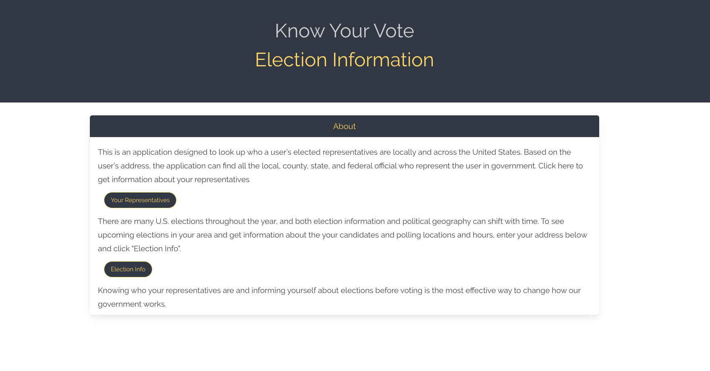

# Project-One
Dec 2019 - Coding Bootcamp Project 1

This application was built with the purpose of allowing the user to access politcal information such as voting candiadtes, polling locaitons and current representives based on the user's input.

When the user opens the application, they are taken to the index page when it states it purpose and allows the user to choose two routes of information. 

The first route allows the user to click on a button that will display a page containing the current representives.

The page allows the user to select certain features to retrieve tailed representative information, such as a picture, if there is one available in the api, the name, current office and url, if available. 

The second route of information appears when the user click's the "election information" button and allows the user to see the upcoming election close to the user's enetered address, the nearby polling location and hours, early voting locations and hours or all information about the running candidates that will be on the ballot.

On that page, the user will input his/her street address in the search box which will auto fill, if the user allows geolocation. The address is used to pull user specific infromation from the api and depending on the button the user clicks:

-polling location,
-early voting locations or
-candidates,

specific information will be presented under the address row. 

The polling information contains the election name and the date the election occurs, displays a map and a pin that allows the user to locate the nearest voting location in accordance with thier home address, and a section that states the polling location name and hours.

The early voting infromation shows where the user could vote early with each location having its own card with location name and days and hours early voting is possible. 

The candidate information sorts the cardidate depending on ballot location, office and party in a card for each candidate. The card color is related to the party that they are affiliated with.

<a href="#">Election Info Application</a>
